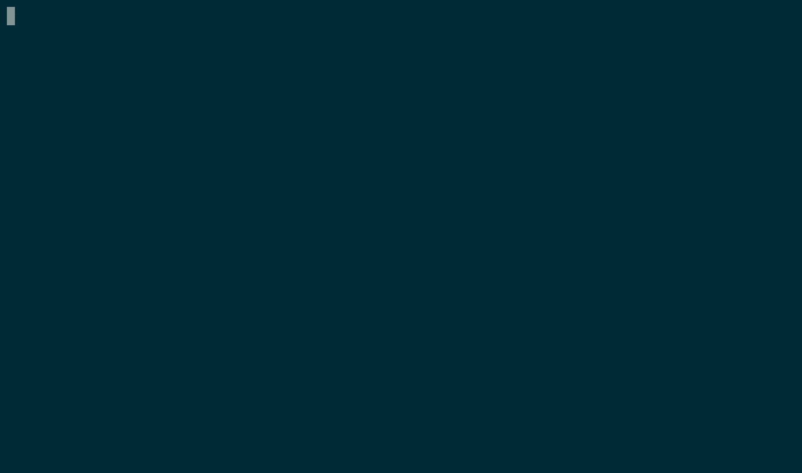

# Cryptographon

 

**What is Cryptographon?**

Cryptographon is a set of code examples and games to show kids (or adults) the principles behind cryptography.

*It's currently a work in progress!*

**Why?**

My two young girls (then nine and ten-years old) were playing a game. They'd created their own simple codebook where their secret messages were encoded into numbers. It was a great idea, but it took them ages to create their messages, they needed a [Cipher](https://en.wikipedia.org/wiki/Cipher)!

So, I had an idea. They were very excited about their secrets and making it easier to send their messages. I was very keen on them learning to code. I agreed to set something up so they could write their messages by writing .

[Why Cryptography and why it is important?](Cryptography.md)

## Step One

Turning their codebook into a cipher using code. You can see that here:

- [Cipher One](cipher-one/README.md)

Let's try it out. Follow these instructions:

Or, do it online using `trinket.io`:

[On trinket.io](https://trinket.io/embed/python/6569723a94)

## Step Two

List out the problems. Think like spies:

- How good is our first computer cipher?
- And how would hackers attack it?
- Is it usable?

The answers to these questions will lead us to the next stage:

- [Cipher Two](cipher-two/README.md)
