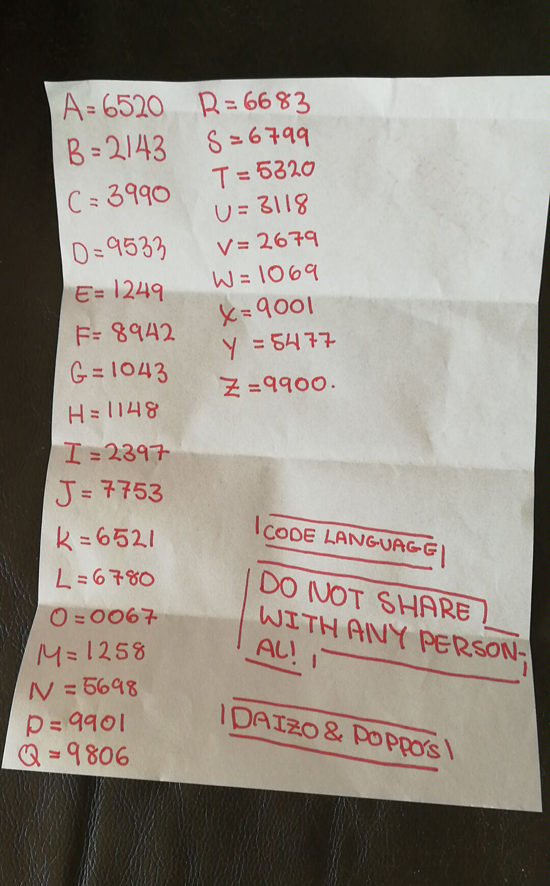

# Cipher One

The ``cipher-one`` code is based on the girls original paper cipher.

We turned this paper into mini programs that do exactly what your would do with paper and pen. You need some pretty good computer skills to use them, but you're spies, or something, right!

## Python

The quickest to build this in was going to be [Python](https://www.python.org/). 

Python is:

- Easy to write
- Easy to understand / read
- Nice to play with and change

But, we're dealing with secrets here! And Python is in an open text format. Sure we could do something to obfuscate the internals, but nonetheless, Python is an interpreted language and as such can be [simply read or worked out fairly easily](https://stackoverflow.com/questions/261638/how-do-i-protect-python-code).

Still, as a starting point Python is great:

[Try it online!](https://tio.run/##tVZZb9tGEH7nr5gwD5IQSZVsWZaMCmgOAwmQJoFTtA9JQKzJFbkRyWW4pBz1@O3uzF4MLdt9KgGb1OzMN/fsVIcmk@Xp7e1TuGRxBjlvGl5DxhQwWEwSkYoGXr5/dTkNgqfwWuYJNBmHWCYcOYgpEXEjZMnqwxiUpNMDVDk7wI1oMkBpUXoRhPiN7ThKVaxmBSh2EGUKjQRe0jnIGhJ@H6cGI5iCK8VSOn9ToqWs4UiuZZv2jiHOWJlqbCQapxTpIewxqdmLmE/2SGVBIIpK1g2wOkVlipOnVzzlpYPnFI9Mu7cr5Q3cZAJDRcLoOJ4LBUJdoBSPMwmTEmTJp9UB/gaVsZOzpWqL4PfLq49v3r@DDYTz6WwMs/lkvpqczOarkHzVVpYpOim3PlxQYSqM8QHlIHp7SQALFHgOuZS7tiJ2nQzNgId/BYBPyEK4gHB5djILx4ZyrSkn88Wpo8Sacrpee55EU9Znp56Ha8r8ZLF2lK2mrNaLE0dJDc@sQ84MZb5YOYow2k/X547yVVPOz8@81M7ZPHeU3FDOV97CQlNms6XHKa2FZ16X1JSz5dpTKuPXeuaRvxnKarZ0lNroWq68PcpqX3vfG4N82kW1NTGcz72uvfEUxRzlxsZn6SnfjfZZZ8/BIC/OvV9/OptnYfBPEMQ5UwouqU2wrC@/x7yithv6r9GFkQvDKyYUxyLlJVyzBPYsb6lZa6wnxOAJbLH@uUVC/sChv@L/C3rCt7a/h1Gh0g5Kv7VLhACp2COoa3B9@IvpfhK70E3i@tuPjB5WVYuyGYYuShfwOQzhmRbHV4i/RppPtk3VNtSLRo5MjmlQaUWaRI/A3prm8obXwxGdUot1pz8APdvos0@e@wt4Np4TDGw2MIDBQ9J49IOA4n2@Wof8OPfeUdgykfPkCXzIOUPWFv9kmR@A5VXGrnkjYpbbVD2xMaBHf9S8aevSGmOyZWbwMKL/d9Kla@S/0kUsJl96jGGy7FS/J1mu6HyytMhj2dIM9@ROa@0lj6IeQvhQ1OMevQ/rU4djeajjAD/D4uJY4ginJ4MG3BHqm7AVZRLt@MGwHzH2bbqTKbwGXnAsOHMD5aLkeA3B11Y1oJp2u6W4F3SJ0n1S1TKl3GB9CLxV8AiLRCfbm4D10SXb6iJRPKNrRl8w3W1v808MurBcWom7l5zdGPaue6ai4YUajnpp2lOUEKMfJ4OzCyyT/km4HZdpi@OhFb6TGBGzV5i6m8ILHFX05aq/32TWWdRh6j/lTURX/vDeeJhLXe8E2kEdfrcNsJIUFRUNRLu0sAabkYgFHlKa@h1gN4MR7iFbiKKSFTyK9LyIooKJMors2NDLSY1BcYvK9HmdtgUvmw/6ZIh9GddCB2ETurnqVyoFisfohmtZZUNhYKcsSSJm8YYDptM8GB9VpHsynleb8GODG5Ki2wADU/c2MJXJFrfFa24HddJZkoQP4@IGhZuZ2nwKjVg4xrVES4VfHrHXah2MrWH33hXwkzVgDMOC2gSNw8L8HH5rJbrxORw9FpLJHtEHk4nNtFd1pStDPVwa1g0T0s2gk7dfm67cRmaOolKFebZm6BcZgo0TuH6gn1MDqfvCYv3QHh1q4IfZXSkb2U7IDuVfTehwAcFJbG8DLWtjOnoE0@btCPOlvhQI0C4DdwBvb2/Nwe1rnucS/pB1nvwL)

## Rust

There are other languages out there that are more secure.

[Rust](https://www.rust-lang.org/en-US/) on the other hand is compiled. What does that mean? If means that in order to run it you have to do an extra step and create a binary file using a compiler, in this case ``rustc``. A binary file is hard (but not impossible) to put back into a readable format. So our secrets are more secure.

Compiled languages are also faster to run, and in the case of Rust safer as it applies a lot of code checking with you compile it so you code is less likely to break when run. But, Rust:

- It's hard to write at first
- It's hard to read - it's real computer code, a lot doesn't make sense
- It's difficult to make changes and play with.

## Problems

- What are the problems with ``cipher-one``?
- How can we improve it?
- What else must it do for it to be really secure?
